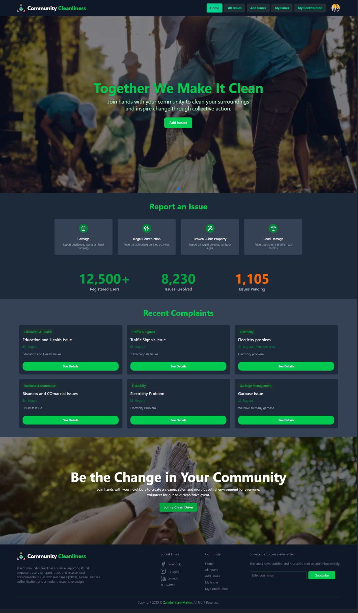
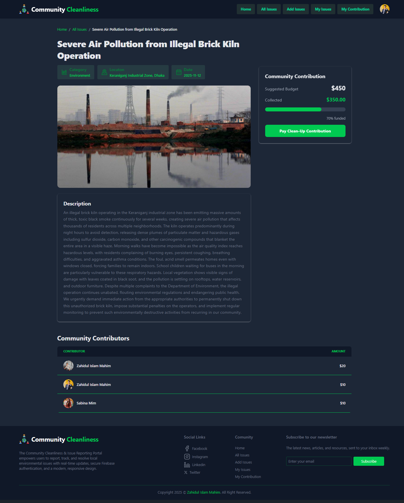

# Community Cleanliness & Issue Reporting Portal

**Community Cleanliness & Issue Reporting Portal** is a modern, full-stack **MERN web application** that enables users to report, track, and contribute to community cleanliness issues, such as garbage buildup, broken public property, illegal construction, and road damage.  
Built with **React, Tailwind CSS, Firebase, Express.js, and MongoDB**, it offers secure authentication, dynamic issue tracking, contribution management, and a clean, responsive UI for a smooth user experience.

---

## 🔗 Live Links

🌐 **Live Site:** [Community Cleanliness Portal](https://b12-assignment-10.netlify.app/)

---

## 🔗 GitHub Links

🌐 **Client Code:** [GitHub Repository](https://github.com/zahidulislammahim/B12-Assignment-10-Client)

---

## 🧠 Overview

This portal allows users to:  
- Report community issues such as garbage, illegal construction, broken public property, and road damage.  
- Track the latest complaints and issue statuses.  
- Make financial contributions for cleanups.  
- View their contribution history and download PDF reports.  
- Access all features securely with Firebase authentication.  
- Participate in volunteer clean drives.  

---

## Tech Stack

### 🖥️ Frontend

| Technology | Version | Description |
|------------|---------|-------------|
| React | ^18.2.0 | Component-based frontend library |
| React Router | ^6.14.2 | Client-side routing |
| Tailwind CSS | ^3.3.2 | Utility-first CSS framework |
| Firebase | ^12.5.0 | Authentication & backend services |
| Axios | ^1.4.0 | HTTP client for API requests |
| React Icons | ^4.10.1 | Icon library for UI components |
| jsPDF | ^2.5.1 | Generate PDF reports |
| jspdf-autotable | ^3.5.28 | Table export support for PDFs |
| SweetAlert2 | ^11.7.12 | Elegant alert notifications |

### ⚙️ Backend

| Technology | Version | Description |
|------------|---------|-------------|
| Node.js | ^20.5.0 | JavaScript runtime environment |
| Express.js | ^4.18.2 | Web framework for backend APIs |
| MongoDB | ^6.20.0 | NoSQL database |
| Firebase Admin | ^13.6.0 | Server-side Firebase SDK |
| CORS | ^2.8.5 | Cross-origin resource sharing |
| dotenv | ^17.2.3 | Environment variable management |

---

## ⚙️ Features

✅ User Authentication (Firebase Email/Password & Google Login)  
✅ Add, Edit, and Delete community issues  
✅ Report issue details with image upload  
✅ View latest complaints and issue statistics  
✅ Make contributions/payments for cleanups  
✅ Download contribution reports as PDF  
✅ Dynamic routing with React Router  
✅ Optional dark/light mode toggle  
✅ Responsive UI across devices  
✅ Toast/SweetAlert notifications for all actions  

---

## 📁 Folder Structure
```
B12-Assignment-10-Client/
├── src/
│ ├── components/ # Reusable React components
│ ├── pages/ # Route pages (Home, Issues, My Contributions, etc.)
│ ├── context/ # Auth & other contexts
│ ├── assets/ # Images, icons, and static files
│ ├── App.jsx
│ └── main.jsx
├── public/
└── package.json
```

## 🚀 Installation & Setup
### Frontend Setup
```bash
git clone https://github.com/zahidulislammahim/B12-Assignment-10-Client.git
cd B12-Assignment-10-Client
npm install
npm run dev
```
```
cd server
npm install
# Create .env file with:
# PORT=3000
# DB_USER=your_mongo_username
# DB_PASS=your_mongo_password
node index.js
```
## 📊 API Endpoints

| Method | Endpoint | Description |
|--------|----------|-------------|
| GET | `/issues` | Fetch all issues |
| GET | `/issues/:id` | Fetch a specific issue by ID |
| GET | `/my-issues` | Fetch issues created by logged-in user |
| POST | `/issues` | Add a new issue |
| PUT | `/issues/:id` | Update an existing issue |
| DELETE | `/issues/:id` | Delete a specific issue |
| GET | `/contribution` | Fetch logged-in user's contributions |
| POST | `/contribution` | Add a new contribution |
| GET | `/contribution/:issueId` | Fetch all contributions for a specific issue |


## 🎨 UI & Theme
Clean and modern UI designed with Tailwind CSS

Responsive design for desktop, tablet, and mobile

Optional dark/light theme toggle

Accessibility-focused components
# 🖼️ Screenshots
### 🏠 Homepage

### 🎮 Game Details


## 📧 Contact
👤 Author: Zahidul Islam Mahim

📍 Location: Dhaka, Bangladesh

📩 Email: mahimkhan20626@gmail.com

🌐 Live Site: Community Portal
